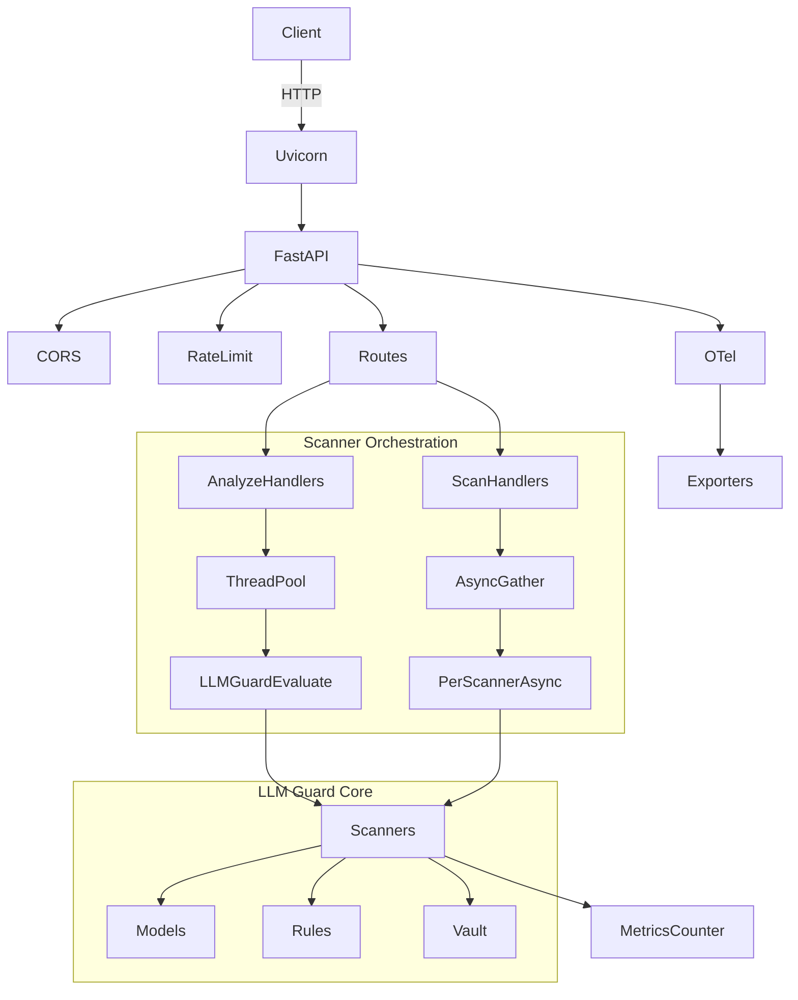
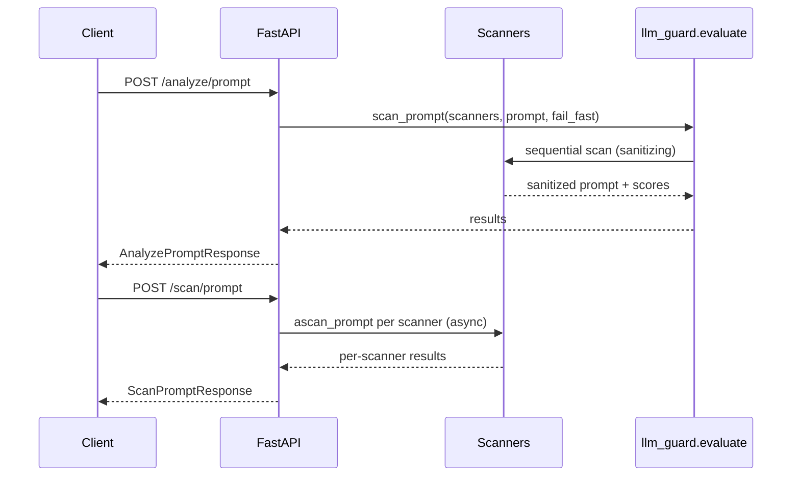

# LLM Guard API - Technical Report

## Executive Summary
This codebase implements a FastAPI service that exposes "guardrail" scanning for LLM prompts and outputs. The service loads a configurable pipeline of scanners, runs them either sequentially (sanitizing text) or in parallel (scoring only), and returns validation status plus per-scanner risk scores. It is designed to run as a stateless HTTP API with optional rate limiting, auth, and OpenTelemetry (OTel) instrumentation. The core scanning logic is provided by the local `llm_guard` package, which integrates rule-based scanners, ML classifiers, and NER-based PII detection, with optional ONNX acceleration.

## Scope and Goals
Primary goals:
- Provide a simple HTTP API to scan prompts and model outputs.
- Support both sanitization (analyze) and scoring-only (scan).
- Allow flexible, config-driven scanner composition.
- Provide observability (metrics + tracing) for production usage.

Non-goals (current implementation):
- It does not run or manage LLM inference.
- It does not persist data; all state is in-memory and process-local.
- It does not enforce strict auth by default (dependency is present but commented out).

## System Design Overview

### High-level Component Diagram


### Runtime Request Flow (Analyze vs Scan)


## Core Components

### 1) Application Bootstrapping
Files:
- `app/app.py`
- `app/config.py`
- `app/otel.py`
- `entrypoint.sh`

Boot sequence:
1. `entrypoint.sh` starts Uvicorn: `uvicorn app.app:create_app`.
2. `create_app()` loads YAML config (default `./config/scanners.yml`).
3. Logging is configured (structlog).
4. OTel tracing/metrics configured.
5. A shared `Vault` instance is created.
6. Scanner factories are built (lazy or eager).
7. Routes, middleware, and exception handlers are registered.
8. FastAPI is instrumented.

Key implementation details:
- Config values are templated via `!envvar` to support environment overrides.
- OpenAPI docs are disabled unless log level is `DEBUG`.
- `config.app.lazy_load` allows deferring model loading to first request.

### 2) HTTP API Layer
The API is exposed via FastAPI and Uvicorn. Middleware includes:
- CORS: permissive, allows all origins and methods.
- Rate limiting: optional; based on client IP with `slowapi`.
- Exception handling: standardized JSON payloads for HTTP and validation errors.

Auth:
- Supports HTTP Bearer and HTTP Basic in config.
- The dependency is currently commented out in route handlers, so auth is not enforced.

OpenAPI:
- Runtime docs are disabled unless `log_level == DEBUG`.
- A static `openapi.json` is present in the repo for reference.

#### API Endpoints
| Method | Path | Purpose | Request | Response |
|---|---|---|---|---|
| GET | `/` | Service banner | - | `{ "name": "LLM Guard API" }` |
| GET | `/healthz` | Liveness | - | `{ "status": "alive" }` |
| GET | `/readyz` | Readiness | - | `{ "status": "ready" }` |
| POST | `/analyze/prompt` | Sanitize + score prompt | `AnalyzePromptRequest` | `AnalyzePromptResponse` |
| POST | `/scan/prompt` | Score-only prompt | `ScanPromptRequest` | `ScanPromptResponse` |
| POST | `/analyze/output` | Sanitize + score output | `AnalyzeOutputRequest` | `AnalyzeOutputResponse` |
| POST | `/scan/output` | Score-only output | `ScanOutputRequest` | `ScanOutputResponse` |
| GET | `/metrics` | Prometheus metrics | - | Prometheus text format |

Request/response schemas live in `app/schemas.py`.

### 3) Scanner Orchestration
There are two execution modes:

**Analyze (sanitizing, sequential)**
- Endpoints: `/analyze/prompt`, `/analyze/output`.
- Implementation: `llm_guard.evaluate.scan_prompt/scan_output`.
- Execution: sequential, respects `scan_fail_fast` (stop on first invalid).
- Output: sanitized text + per-scanner scores.
- Threading: run in a `ThreadPoolExecutor` to keep event loop free.

**Scan (scoring only, parallel)**
- Endpoints: `/scan/prompt`, `/scan/output`.
- Implementation: `app.scanner.ascan_prompt/ascan_output`.
- Execution: all scanners run in parallel via `asyncio.gather`.
- Output: per-scanner scores only; sanitized text is not returned.
- Failure handling: uses `InputIsInvalid` exception for invalid results; optionally fail-fast.

Notes:
- The scan endpoints ignore sanitized output and only return scores/validity.
- `scanners_suppress` can disable scanners by class name (e.g., `Toxicity`, `BanTopics`).

### 4) Scanner Registry and Model Configuration
`app/scanner.py` builds scanner instances from `config/scanners.yml`.

Key behaviors:
- Supports eager or lazy loading of scanners (`app.lazy_load`).
- Selectively enables ONNX execution for supported scanners.
- Allows per-scanner config overrides (model_path, batch size, max length).
- Injects a shared `Vault` into Anonymize/Deanonymize for reversible masking.

Models are represented by the `Model` dataclass (`llm_guard/model.py`) and loaded through helpers:
- Tokenizer/model caching is handled with `lru_cache`.
- ONNX is used if `optimum.onnxruntime` is installed.
- `lazy_load_dep` defers heavy imports and warns if missing.

### 5) Vault and Anonymization
The `Vault` is a process-local, in-memory store for placeholder-to-original mappings:
- **Anonymize**: replaces entities with placeholders and stores originals in Vault.
- **Deanonymize**: uses Vault to restore placeholders.

Important design note:
- The Vault is per process, not shared across workers. In multi-worker deployments, anonymize and deanonymize must run on the same worker to reconstruct originals.

### 6) Observability
Instrumentation:
- `FastAPIInstrumentor` provides request spans and metrics.
- A custom counter `scanners.valid` tracks per-scanner validity, labeled by `source`, `valid`, and `scanner`.

Exporters:
- Metrics: console, OTLP HTTP, or Prometheus.
- Traces: console or OTLP HTTP (X-Ray is partially supported but not exposed in config enum).

Logging:
- Structured logs via `structlog`.
- JSON output supported via config.

## API Schemas (Summary)

### AnalyzePromptRequest
```json
{ "prompt": "...", "scanners_suppress": ["Toxicity"] }
```

### AnalyzePromptResponse
```json
{
  "sanitized_prompt": "...",
  "is_valid": true,
  "scanners": { "Toxicity": -1.0, "PromptInjection": 0.0 }
}
```

### ScanOutputRequest / Response
```json
{ "prompt": "...", "output": "...", "scanners_suppress": [] }
```

```json
{ "is_valid": true, "scanners": { "Bias": -1.0, "Relevance": 0.1 } }
```

### Error Handling and Status Codes
| Code | Scenario |
|---|---|
| 200 | Successful scan/analyze |
| 408 | Scanner timeout (`scan_prompt_timeout`, `scan_output_timeout`) |
| 422 | Request validation failed |
| 429 | Rate limit exceeded (if enabled) |
| 401 | Auth failure (if enabled and wired) |

Custom exception handlers in `app/app.py` normalize error responses:
- `HTTPException` -> `{ "message": "...", "details": null }`
- `RequestValidationError` -> `{ "message": "Validation failed", "details": [...] }`

## Default Scanner Configuration
Scanner order matters for **analyze** endpoints because sanitization is applied sequentially.

### Input Scanners (from `config/scanners.yml`)
| Scanner | Category | Implementation | Purpose / Notes |
|---|---|---|---|
| Anonymize | PII | NER + regex | Masks PII; uses Vault for reversible placeholders. |
| BanCode | Policy | ML classifier | Detects code-like text. |
| BanCompetitors | Policy | NER | Redacts competitor names if detected. |
| BanSubstrings | Policy | Rule | Substring/word matching. |
| BanTopics | Policy | Zero-shot | Topic banning. |
| Gibberish | Quality | ML classifier | Detects gibberish. |
| InvisibleText | Security | Rule | Detects hidden/invisible text. |
| Language | Locale | ML classifier | Validates allowed languages. |
| PromptInjection | Security | ML classifier | Detects injection attempts. |
| Regex | Security | Rule | Pattern-based detection/redaction. |
| Secrets | Security | Rule + plugins | Uses `detect-secrets` to redact credentials. |
| Sentiment | Quality | Lexicon | VADER sentiment thresholding. |
| TokenLimit | Safety | Rule | Enforces token length. |
| Toxicity | Safety | ML classifier | Detects toxic content. |

### Output Scanners (from `config/scanners.yml`)
| Scanner | Category | Implementation | Purpose / Notes |
|---|---|---|---|
| BanCode | Policy | ML classifier | Blocks code output. |
| BanCompetitors | Policy | NER | Redacts competitor names. |
| BanSubstrings | Policy | Rule | Substring/word matching. |
| BanTopics | Policy | Zero-shot | Topic banning. |
| Bias | Safety | ML classifier | Bias detection. |
| Deanonymize | PII | Rule | Replaces placeholders from Vault. |
| FactualConsistency | Quality | NLI model | Entailment check prompt vs output. |
| Gibberish | Quality | ML classifier | Detects gibberish. |
| Language | Locale | ML classifier | Validates allowed languages. |
| LanguageSame | Locale | ML classifier | Ensures output language matches prompt. |
| MaliciousURLs | Security | ML classifier | Classifies URLs as malicious/benign. |
| NoRefusal | Quality | ML classifier | Detects refusals. |
| ReadingTime | UX | Rule | Limits estimated reading time. |
| Regex | Security | Rule | Pattern-based detection/redaction. |
| Relevance | Quality | Embedding model | Semantic similarity prompt vs output. |
| Sensitive | PII | NER + regex | Detects sensitive info; optional redaction. |
| Sentiment | Quality | Lexicon | Sentiment thresholding. |
| Toxicity | Safety | ML classifier | Toxic content detection. |
| URLReachability | Security | Rule + network | Verifies URLs are reachable. |

## Configuration Model
Configuration is loaded from YAML with environment overrides (`!envvar`).

### App Settings
| Key | Env Var | Default | Description |
|---|---|---|---|
| `app.name` | `APP_NAME` | "LLM Guard API" | Service name |
| `app.log_level` | `LOG_LEVEL` | INFO | Log level |
| `app.log_json` | `LOG_JSON` | true | JSON logs |
| `app.scan_fail_fast` | `SCAN_FAIL_FAST` | false | Stop on first failure |
| `app.scan_prompt_timeout` | `SCAN_PROMPT_TIMEOUT` | 30 | Prompt scan timeout (s) |
| `app.scan_output_timeout` | `SCAN_OUTPUT_TIMEOUT` | 30 | Output scan timeout (s) |
| `app.lazy_load` | `LAZY_LOAD` | true | Lazy load scanners |

### Rate Limiting
| Key | Env Var | Default | Description |
|---|---|---|---|
| `rate_limit.enabled` | `RATE_LIMIT_ENABLED` | false | Enable SlowAPI |
| `rate_limit.limit` | `RATE_LIMIT_LIMIT` | 100/minute | Limit expression |

### Auth
| Key | Env Var | Default | Description |
|---|---|---|---|
| `auth.type` | - | http_bearer | Bearer or basic |
| `auth.token` | `AUTH_TOKEN` | empty | Bearer token |
| `auth.username` | - | empty | HTTP basic username |
| `auth.password` | - | empty | HTTP basic password |

### Telemetry
| Key | Env Var | Default | Description |
|---|---|---|---|
| `tracing.exporter` | `TRACING_EXPORTER` | console | otel_http or console |
| `tracing.endpoint` | `TRACING_OTEL_ENDPOINT` | empty | OTLP traces endpoint |
| `metrics.exporter` | `METRICS_TYPE` | prometheus | prometheus/otel_http/console |
| `metrics.endpoint` | `METRICS_ENDPOINT` | empty | OTLP metrics endpoint |

### Entry Point Env
| Env Var | Default | Description |
|---|---|---|
| `APP_WORKERS` | 1 | Uvicorn worker count |
| `CONFIG_FILE` | ./config/scanners.yml | Config file path |

## Dependency Stack (Runtime)
Core runtime dependencies include:
- FastAPI + Uvicorn for HTTP server and routing.
- Pydantic for request/response validation.
- structlog for structured logging.
- slowapi for rate limiting.
- OpenTelemetry SDK + exporters for tracing/metrics.
- torch + transformers for ML-based scanners.
- optimum.onnxruntime for ONNX acceleration (optional).
- presidio-analyzer/anonymizer + spaCy for PII detection.
- detect-secrets for credential leakage detection.

Python version: >= 3.10, < 3.13 (per `pyproject.toml`).

## Data Handling and Privacy
- Analyze endpoints return sanitized text; scan endpoints do not.
- Debug logging may include prompt/output fields in logs.
- PII masking is in-memory and reversible only within the same process (Vault).

## Scanner Ordering Semantics
- The scanner order in `config/scanners.yml` is the execution order for **analyze**.
- Reordering can change the final sanitized output (for example, anonymize before regex redaction).

## How the System Achieves Its Service
The service provides "guardrail scanning" as a standalone HTTP API:
- **Input guardrails**: sanitizes user prompts before LLM inference.
- **Output guardrails**: filters model outputs before returning to user.
- **Policy enforcement**: blocks or flags toxic, prompt-injection, banned topics, etc.
- **PII handling**: detects and optionally redacts sensitive data, with reversible anonymization via Vault.
- **Quality checks**: relevance, factual consistency, language matching, gibberish detection.
- **Security checks**: secrets, malicious URLs, URL reachability.

This design enables flexible placement in LLM systems:
- As a pre-processing step before model inference.
- As a post-processing step before returning model output.
- As a stand-alone audit/monitoring tool.

## Performance and Concurrency Considerations
- **Analyze endpoints** run scanners sequentially and can be slower for large pipelines.
- **Scan endpoints** run scanners concurrently and are better for throughput, but do not return sanitized output.
- Model loading can be expensive; `lazy_load` reduces startup time at the cost of first-request latency.
- `torch.set_num_threads(1)` caps per-process CPU usage for inference-heavy workloads.
- Timeouts are enforced for prompt/output scanning; exceeded timeouts return HTTP 408.

## Security and Operational Risks
1. **Auth not enforced by default**: auth dependency is present but commented out in routes.
2. **CORS is permissive**: `allow_origins=["*"]` is not suitable for locked-down deployments.
3. **Vault is process-local**: anonymize/deanonymize consistency breaks across workers or instances.
4. **Model loading surface**: large models can cause memory pressure and slow cold starts.
5. **URLReachability** can introduce outbound network dependencies and latency.

## Deployment and Packaging
Supported deployment paths:
- Local: `uvicorn app.app:create_app`.
- Docker (CPU): `Dockerfile` uses Python 3.12-slim and installs `llm-guard[onnxruntime]`.
- Docker (GPU): `Dockerfile-cuda` uses CUDA base image and `llm-guard[onnxruntime-gpu]`.
- Compose: `docker-compose.yml` mounts `config/scanners.yml`.

Important packaging detail:
- The `pyproject.toml` lists `llm-guard` as a dependency and only packages the `app` module.
- The repo includes a local `llm_guard/` directory, but Docker builds do not copy it.
- If you rely on local modifications to `llm_guard`, update the Dockerfile and packaging accordingly.

## Extensibility
To add a new scanner:
1. Implement a scanner class in `llm_guard/input_scanners` or `llm_guard/output_scanners`.
2. Register it in the corresponding `util.get_scanner_by_name`.
3. Add config entry in `config/scanners.yml`.
4. (Optional) update `app/scanner.py` to wire model defaults or ONNX settings.

## Testing and Validation Gaps
The repo does not include explicit test suites. Consider adding:
- Unit tests for each scanner wrapper.
- Integration tests for API routes with mocked scanners.
- Load tests for scan vs analyze endpoints.

## Appendix A: Code Map
| Area | Key Files |
|---|---|
| API | `app/app.py`, `app/schemas.py` |
| Config | `app/config.py`, `config/scanners.yml` |
| Orchestration | `app/scanner.py` |
| Telemetry | `app/otel.py` |
| Core Scanning | `llm_guard/evaluate.py`, `llm_guard/*_scanners` |
| Deployment | `Dockerfile`, `Dockerfile-cuda`, `entrypoint.sh`, `docker-compose.yml` |
